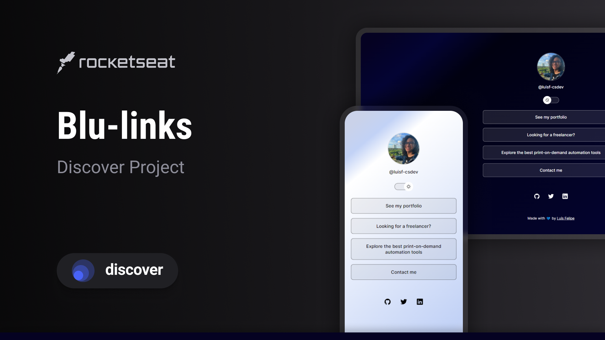

<div align="center">

# Blu-links 💿

</div>

<div align="center">
    
    
    
    
    
</div>

<p align="center">A link aggregator with a blue gradient and CD-like shimmer background 🔗🔷</p>

<h4 align="center">
    <a href="#-see-it-here">Access</a> •
    <a href="#-development">Development</a> •
    <a href="#-stacks">Stacks</a> •
    <a href="#-layout">Layout</a> •
    <a href="#-credits">Credits</a> •
    <a href="#excelsior-code--by-luís-felipe">Author</a>
</h4>
<br>

## 👀 [See it here](https://luisf-csdev.github.io/blu-links)

<p align="center">
  
</p>

## 💻 Development

Ensure you have the following installed to develop you own Blu-links:

- [GIT](https://git-scm.com/)
- [VSCode](https://code.visualstudio.com/)
- [Live Server](https://marketplace.visualstudio.com/items?itemName=ritwickdey.LiveServer)

Clone the repository and jump straight into task management:

```bash
# Clone the repository
git clone https://github.com/luisf-csdev/purr.git

# Navigate to the project directory
cd blu-links

# Open it with VSCode
code .

# Open the index.html

# Open the context menu (right click)

# Choose the "Open with Live Server" (or similar) option

# Blu-links will open in your browser, probably on <http://localhost:5500>
```

<br>

## 💽 Stacks

<div>
    
    
    
</div>
<br>

## 🔖 Layout

You can view the project layout [here](https://www.figma.com/community/file/1187422022288947321). You must have an account on [Figma](https://figma.com) to access it.
<br/>

## 👤 Credits

Challenge proposed by [Rocketseat](https://www.rocketseat.com.br/) 🚀

UI inspired by the design of [Ilana Mallak](https://www.linkedin.com/in/ilanamallak/) 🎨

##

<div align="center">

#### Excelsior code 💙 by Luís Felipe

[🪐 Take a look at my LinkedIn 🪐](https://www.linkedin.com/in/luisf-csdev/)

</div>
